# XBlock-Poll

> A user-friendly way to query students.

This XBlock has been contributed by [McKinsey Academy](http://mckinseyacademy.com/), and is published under the
AGPLv3 licence (see the [LICENSE](LICENSE) file). It has been developed by [OpenCraft](http://opencraft.com).

## Introduction

This XBlock enables a course author to create survey/poll elements to get
feedback from students. The XBlocks can either be _poll_ or _survey_ XBlocks. _Poll_ XBlocks have one
question, and a series of answers. _Survey_ XBlocks have several questions and a handful of (terse) answers that
a student is expected to answer each one from (Such as 'True', and 'False', or 'Agree' or 'Disagree')

## Feature Overview

Survey and Poll are both designed to minimize the amount of fiddling a course author will have to
do in order to create the user experience they desire. By default, answers in polls and questions in surveys
are able to be enhanced with [Markdown](http://daringfireball.net/projects/markdown/syntax) (though it is not recommended to do more than line formatting with it)
and images. Formatting for images is handled by the XBlock's formatters to keep a consistent and sane user experience.

The feedback section of a poll or survey is shown after a user has completed the block. It, along with a poll block's
question field, is intended to make full use of Markdown.

These blocks currently do not support grading.

## Installation and configuration

This XBlock relies on [Xblock-utils](https://github.com/edx-solutions/xblock-utils), which should be installed first.

After this, XBlock-poll may be installed using its setup.py, or if you prefer to use pip, running:

```shell
$ pip install git+https://github.com/open-craft/xblock-poll.git
```

You may specify the `-e` flag if you intend to develop on the repo.

### Setting up a course to use Polls and Surveys

To set up a course to use the Poll and Survey XBlocks, first go to your course's outline page in the studio and look
for the Advanced settings link in the top menus.

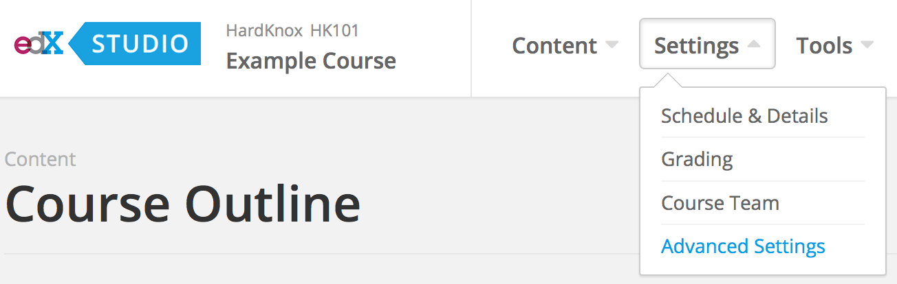

Once there, look for the _Advanced Modules List_ and add `"poll"` and `"survey"` to it.

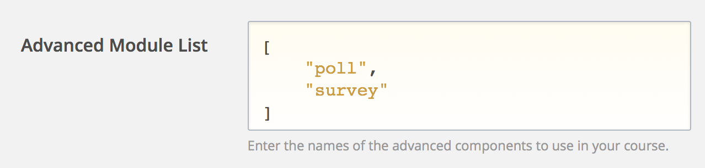

Save your changes, and you may now add a poll by clicking on the **Advanced Modules** button at the bottom of a
unit editing page and selecting either `Poll` or `Survey`.

## Poll Examples

Polls contain a single question, letting users select from an array of answers for a choice that suits them best.

Below is an example of a poll:

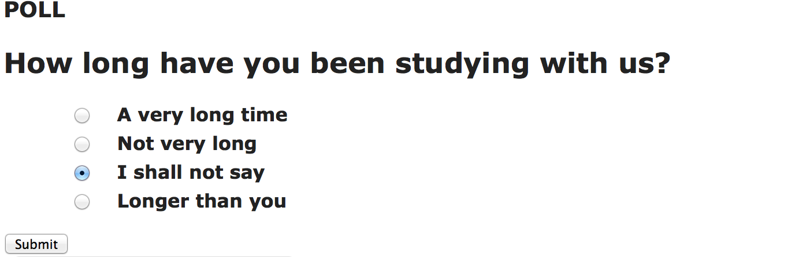

When a user makes a selection and hits `submit`, their choice is sent to the server, and a tally of the results so far
is presented to them.

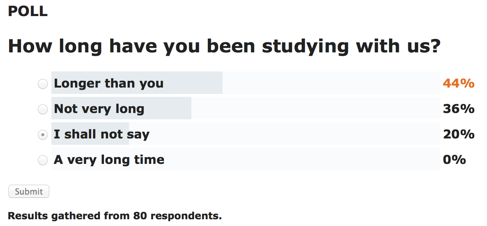

The top choice's percentage is highlighted while the user's selection is marked by a selected (but disabled)
radio button on the side.

### Poll variations

Polls may have several customizations. Feedback may be added to a poll for display after the user has submitted their
answer. Answers may have images associated with them. The question, feedback, and answers are all permitted to contain
[Markdown](http://daringfireball.net/projects/markdown/syntax) (as well as arbitrary HTML) and so maybe customized in the studio (as discussed in the next chapter).

Here is an example of a poll that uses markdown in the question and the answers, and which uses images for each
of the answers:

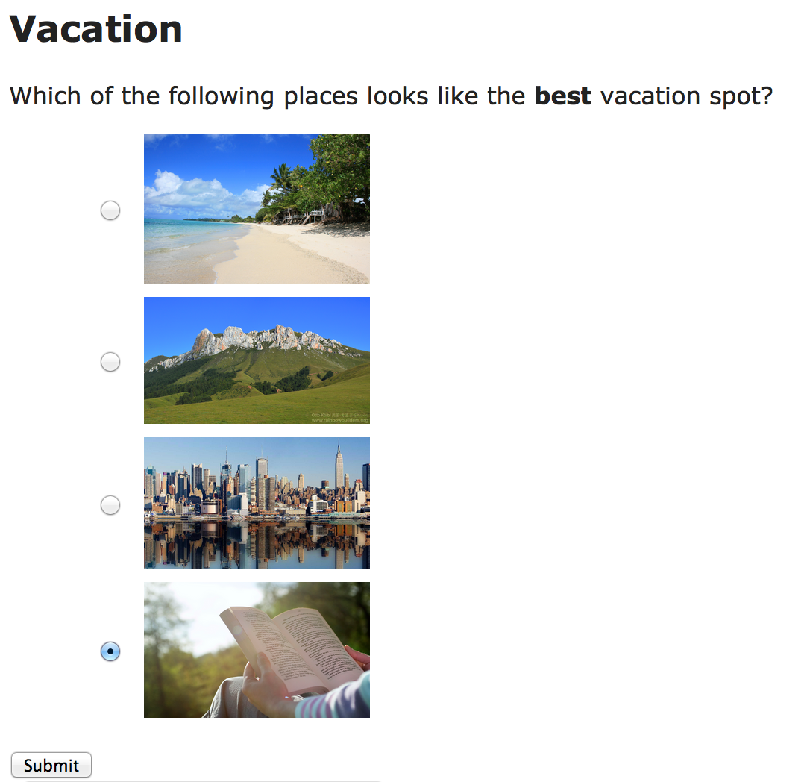

Please note that using only images is not accessible as Poll XBlock does not provide means for specifying alternate
text for images. Instead use images _and_ texts:

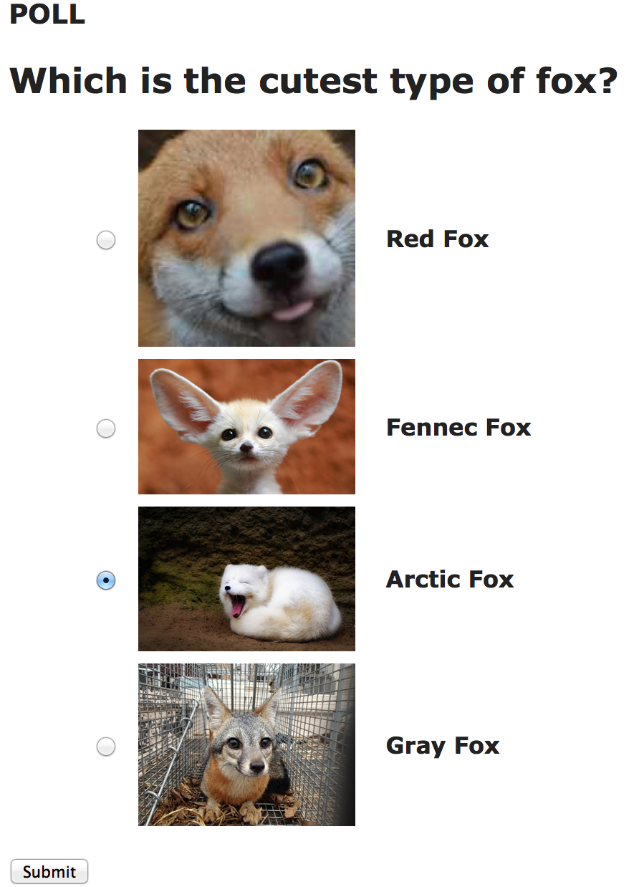

This poll also contains a feedback section, which is enhanced with Markdown:

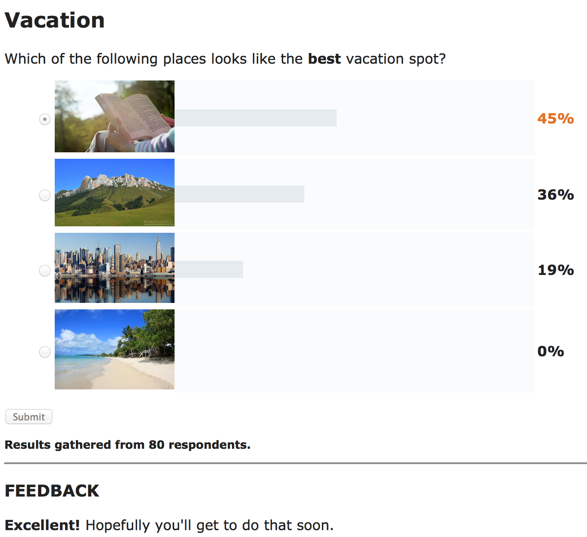

Or they may have a mix of both.

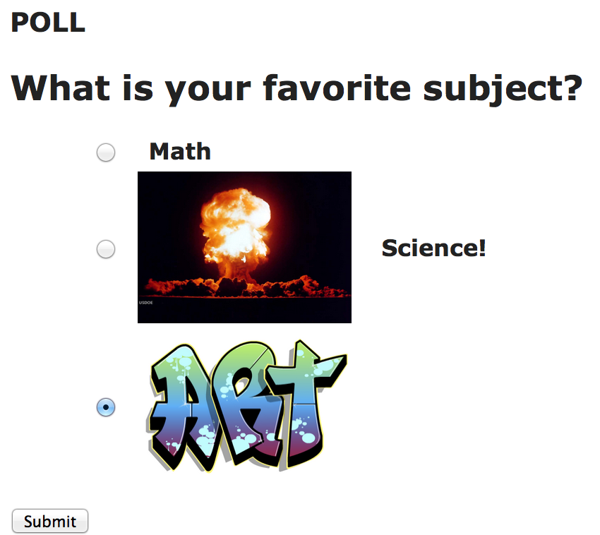

Polls that have a combination of both images and text will autoformat their results so that the bars line up.

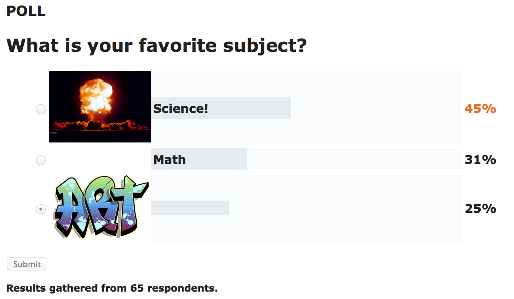

## Survey Examples

A survey has multiple answers and multiple questions. The same answers are presented for each question.

Below is an example of a survey:

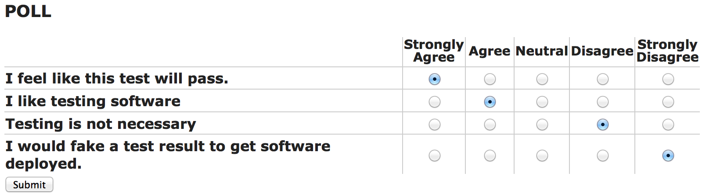

When the user hits `submit`, their answer is sent to the server for tally. The results are then returned to them.

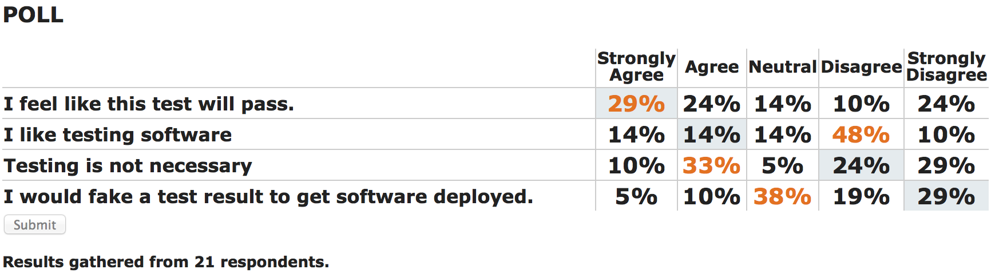

The top choice's percentage is shown in _orange_ while the user's selection is marked with a shaded background.

### Survey Variations

Surveys, like polls, may have several customizations. As there are multiple questions but the answers are static,
questions have the ability to use images, rather than answers. Surveys may also have a Feedback section, just as
polls do.

Here is an example of a survey that mixes use of Markdown and images in its questions:

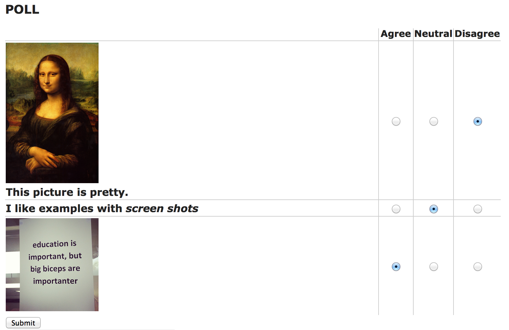

...And here's that survey's result page (with a feedback section that uses Markdown):

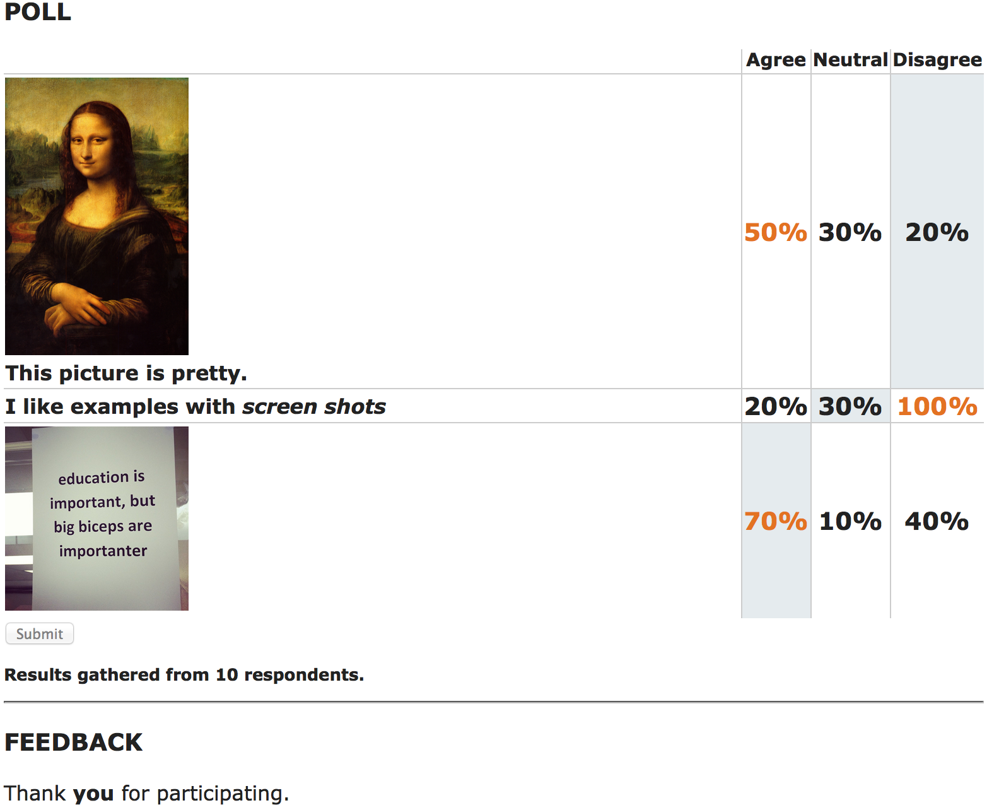

## Using the Studio to create Polls and Surveys

After adding a Poll or Survey to the unit you're editing, click the edit button to bring up the studio menu.

Polls will have a `Question` field, and both polls and surveys will have a `Feedback` field.

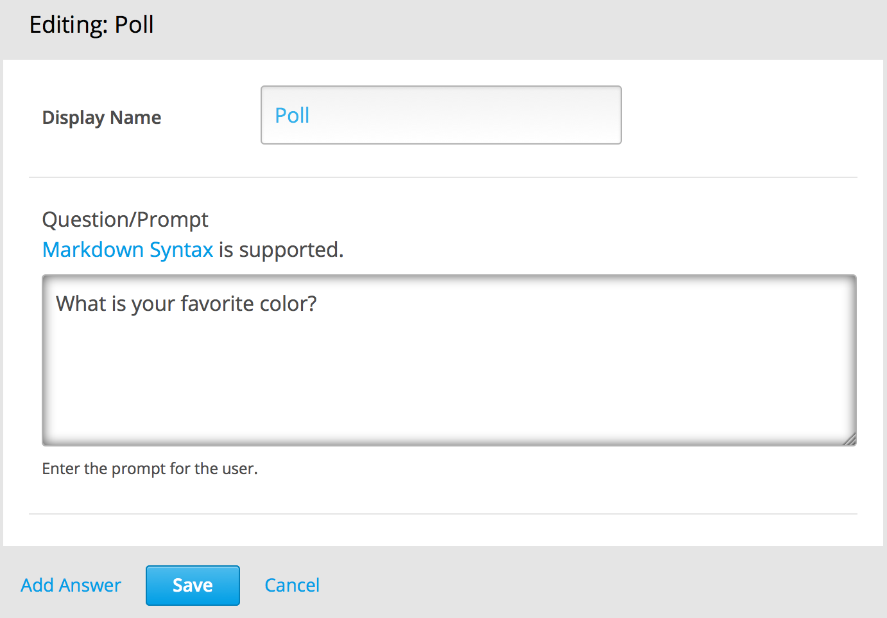

After these fields, there will be a series of line items. Polls will have a set of `Answers`:

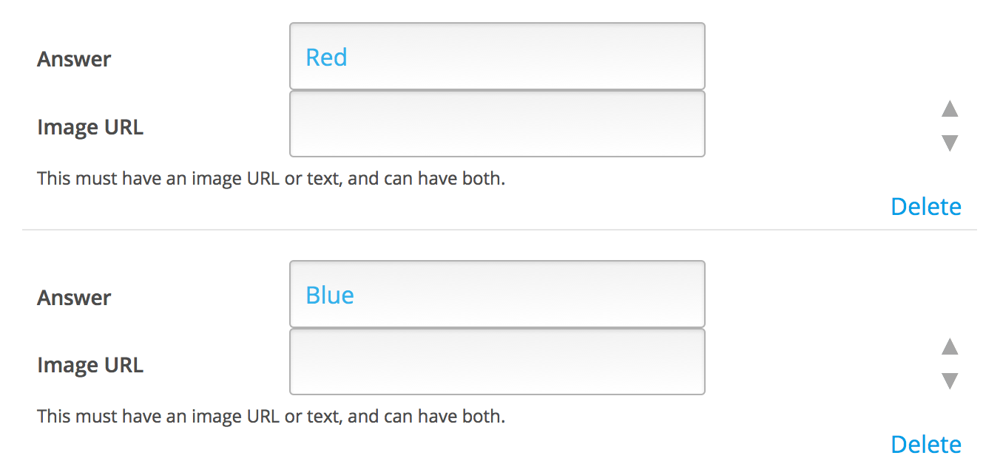

...while Surveys will have both `Questions` and `Answers`:

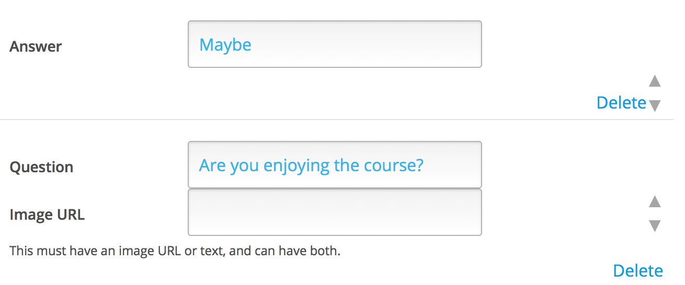

In polls, answers may be given images, while in surveys, questions may be given them.
See the examples sections to get an idea of how images look and fit into the layout of a poll or survey.

Questions and answers may be enhanced with Markdown and HTML. **This markup is not sanitized, and is treated as trusted
input by course authors.**

For example, putting this into a Poll's Answer field:

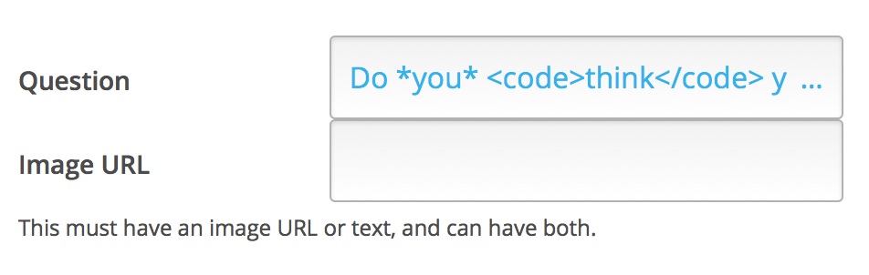

... Would yield this when rendered:

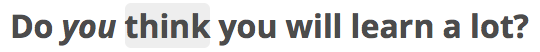

The following fields are customizable with [Markdown](http://daringfireball.net/projects/markdown/syntax) and custom HTML on Polls:

- Question
- Feedback
- Answers

The following fields are customizable with Markdown and custom HTML on Surveys:

- Feedback
- Questions

You may add another answer (or question, if creating a survey) by clicking the add links at the bottom of the form:

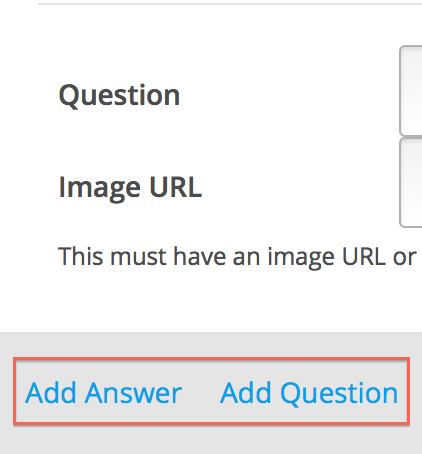

Questions and answers are listed in the order they're used in the student display. If you need to change the order
of questions or answers, **do not swap the values of their fields** if any students may already have voted, as
those votes will be tied to that line item. Instead, use the ordering arrows on the side:

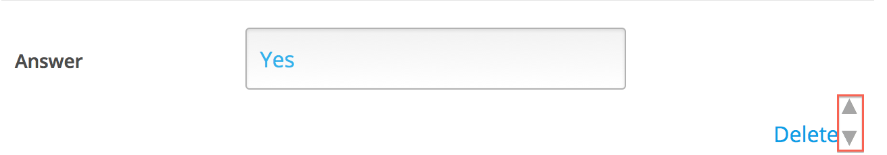

These will allow you to move the question or answer up and down to change its display order.

If you need to remove a question or answer, you can use the `Delete` link:

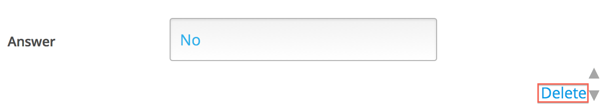

**Remember**: You must have at least two answers (and at least two questions, in the case of polls). If a user has
voted on/for the item you've deleted, they will be permitted to vote again, but will not lose progress.

You may also create a poll or survey in which the results are not shown to the user. To do this, click the checkbox
for 'Private Results':

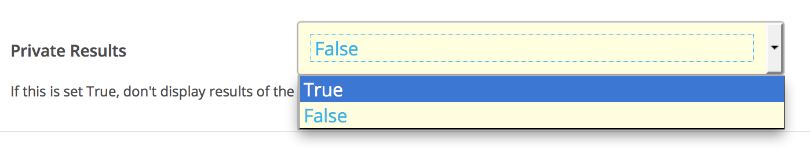

**Notes on Private Results**: Users will be able to change their vote on polls and surveys with this option enabled.
An analytics event will not be fired upon the student viewing the results, as the results are never visible. A user
will see a thank you message, and optionally, any instructor-provided Feedback in an additional "Feedback" section,
when they click submit:

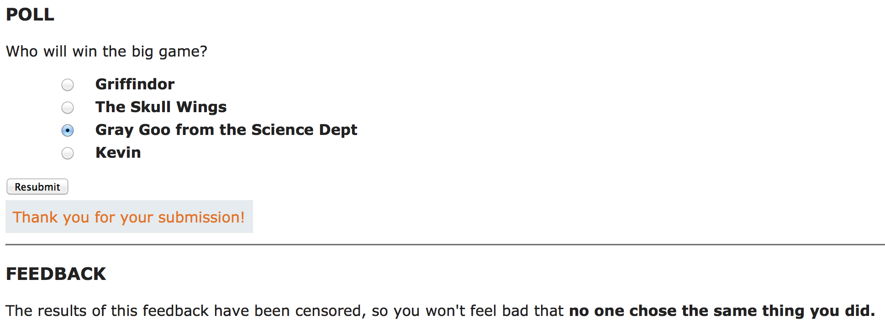

When you are finished customizing your poll or survey, click the `Save` button:

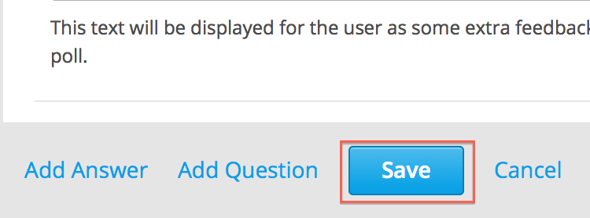

...or to discard your changes, hit `Cancel` instead:

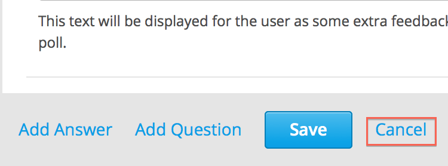

Assuming you saved it, your new poll or survey should be ready to go as soon as you publish your unit's changes.
If there are any issues, you will receive an error message specifying anything that may not be quite right yet.

## Notes

**A poll or survey should not be deployed until its construction is finalized. Changing an answer or question can
cause previous respondent's answers to remap and give an inaccurate picture of the responses.**

If a poll has changed enough that it leaves a previous voter's choice invalid, their response will be eliminated
from the tally upon their next visit, and they will be permitted to vote again. However, they will not lose progress
or their score.

Things that could make a poll's previous answers ambiguous include adding or removing a question, or adding or
removing an answer.

## Analytics

Two events are fired by the XBlocks-- one for viewing the results of a poll, and one for submitting the user's choice.

The resulting events look like this for polls:

```json
{"username": "staff", "host": "precise64", "event_source": "server", "event_type": "xblock.poll.submitted", "context": {"course_user_tags": {}, "user_id": 1, "org_id": "JediAcademy", "module": {"display_name": "Poll"}, "course_id": "JediAcademy/FW301/2015", "path": "/courses/JediAcademy/FW301/2015/xblock/i4x:;_;_JediAcademy;_FW301;_poll;_2d25e451be884aa7a15b33860d7c9647/handler/vote"}, "time": "2015-01-12T19:13:39.199098+00:00", "ip": "10.0.2.2", "event": {"url_name": "2d25e451be884aa7a15b33860d7c9647", "choice": "B"}, "agent": "Mozilla/5.0 (Macintosh; Intel Mac OS X 10.9; rv:34.0) Gecko/20100101 Firefox/34.0", "page": "x_module"}
{"username": "staff", "host": "precise64", "event_source": "server", "event_type": "xblock.poll.view_results", "context": {"course_user_tags": {}, "user_id": 1, "org_id": "JediAcademy", "module": {"display_name": "Poll"}, "course_id": "JediAcademy/FW301/2015", "path": "/courses/JediAcademy/FW301/2015/xblock/i4x:;_;_JediAcademy;_FW301;_poll;_2d25e451be884aa7a15b33860d7c9647/handler/get_results"}, "time": "2015-01-12T19:13:39.474514+00:00", "ip": "10.0.2.2", "event": {}, "agent": "Mozilla/5.0 (Macintosh; Intel Mac OS X 10.9; rv:34.0) Gecko/20100101 Firefox/34.0", "page": "x_module"}
```

... And like this for surveys:

```json
{"username": "staff", "host": "precise64", "event_source": "server", "event_type": "xblock.survey.submitted", "context": {"course_user_tags": {}, "user_id": 1, "org_id": "JediAcademy", "module": {"display_name": "Survey"}, "course_id": "JediAcademy/FW301/2015", "path": "/courses/JediAcademy/FW301/2015/xblock/i4x:;_;_JediAcademy;_FW301;_survey;_e4975240b6c64a1e988bad86ea917070/handler/vote"}, "time": "2015-01-12T19:13:13.115038+00:00", "ip": "10.0.2.2", "event": {"url_name": "e4975240b6c64a1e988bad86ea917070", "choices": {"enjoy": "Y", "learn": "M", "recommend": "N"}}, "agent": "Mozilla/5.0 (Macintosh; Intel Mac OS X 10.9; rv:34.0) Gecko/20100101 Firefox/34.0", "page": "x_module"}
{"username": "staff", "host": "precise64", "event_source": "server", "event_type": "xblock.survey.view_results", "context": {"course_user_tags": {}, "user_id": 1, "org_id": "JediAcademy", "module": {"display_name": "Survey"}, "course_id": "JediAcademy/FW301/2015", "path": "/courses/JediAcademy/FW301/2015/xblock/i4x:;_;_JediAcademy;_FW301;_survey;_e4975240b6c64a1e988bad86ea917070/handler/get_results"}, "time": "2015-01-12T19:13:13.513909+00:00", "ip": "10.0.2.2", "event": {}, "agent": "Mozilla/5.0 (Macintosh; Intel Mac OS X 10.9; rv:34.0) Gecko/20100101 Firefox/34.0", "page": "x_module"}
```

## Viewing the Results

When running inside the edX LMS, course staff members have the ability to view results without voting.
If you want to grant members of other groups ability to view the results, you can configure the group
names in the Django settings using the `XBLOCK_POLL_EXTRA_VIEW_GROUPS` setting, for example:

```python
XBLOCK_POLL_EXTRA_VIEW_GROUPS = ['poll_staff']
```

## Working with Translations

For information about working with translations, see the [Internationalization Support](http://edx.readthedocs.io/projects/xblock-tutorial/en/latest/edx_platform/edx_lms.html#internationalization-support) section of the [Open edX XBlock Tutorial](https://xblock-tutorial.readthedocs.io/en/latest/).

### Working with Transifex

Prepare your environment:

```shell
$ virtualenv -p 3.8 poll-xblock
$ source poll-xblock/bin/activate
$ make requirements
```

Also, ensure that the [Transifex client has the proper authentication](https://docs.transifex.com/client/init)
in the `~/.transifexrc` file.

Push new strings to Transifex:

```shell
$ make push_translations
```

To get the latest translations from Transifex:

```shell
$ make pull_translations
```

For testing purposes it's faster to avoid Transifex and work on dummy Esperanto translations:

```shell
$ make build_dummy_translations
```

## Running Tests Locally

The Selenium tests in this XBlock require Firefox 94.0.1 (the exact version can be found in `Makefile`).

On Linux, it's possible to install it via the command `$ make install_linux_dev_firefox`, but you'd
have to install it on MacOS [manually from the Mozilla website](https://support.mozilla.org/en-US/kb/install-older-version-of-firefox), or you can rely on Travis to do that for you on the cloud.

  * [ ] Assuming that the correct Firefox version has been installed, you can run the following command for the tests on Linux:

```shell
$ make linux_dev_test
```

or something like that on MacOS:

```shell
$ PATH="path/to/firefox/bin/directory:$PATH" make test
```

To run tests using `tox`, simply run: `tox`. Please note that if not all supported python versions are installed, tox will compile and install python from source. For compilation, it may need extra dependencies depending on your system.

## API for native mobile frontends

**Retrieve fixed data for all poll/survey XBlocks in a course:**

```shell
GET https://<lms_server_url>/api/courses/v1/blocks/?course_id=<course_id>&username=<username>&depth=all&requested_fields=student_view_data
```

Example poll return value:

```json
"student_view_data": {
    "feedback": "This is feedback message survey.",
    "private_results": false,
    "max_submissions": 1,
    "question": "Did the explanation above make sense to you?",
    "answers": [
        [
            "R",
            {
                "img_alt": "",
                "img": "",
                "label": "Yes, completely"
            }
        ],
        [
            "B",
            {
                "img_alt": "",
                "img": "",
                "label": "Yes, for the most part"
            }
        ],
        [
            "G",
            {
                "img_alt": "",
                "img": "",
                "label": "Not really"
            }
        ],
        [
            "O",
            {
                "img_alt": "",
                "img": "",
                "label": "Not at all"
            }
        ]
    ]
},
```

Example survey return value:

```json
"student_view_data": {
    "feedback": "This is feedback message survey.",
    "private_results": false,
    "max_submissions": 1,
    "block_name": "Poll2",
    "answers": [
        [
            "Y",
            "Yes"
        ],
        [
            "N",
            "No"
        ],
        [
            "M",
            "Maybe"
        ],
        [
            "1464806559402",
            "Unsure"
        ]
    ],
    "questions": [
        [
            "enjoy",
            {
                "img_alt": "",
                "img": "",
                "label": "Do you think you will use Polls in your course?"
            }
        ],
        [
            "recommend",
            {
                "img_alt": "",
                "img": "",
                "label": "Do you think you will use Surveys in your course?"
            }
        ],
        [
            "learn",
            {
                "img_alt": "",
                "img": "",
                "label": "Do you think the ability to query students is useful?"
            }
        ],
        [
            "1464806513240",
            {
                "img_alt": "",
                "img": "",
                "label": "Do you like taking Polls and/or Surveys?"
            }
        ]
    ]
},
```

**Retrieve current poll tally and current user's vote**

```shell
GET https://<lms_server_url>/courses/<course_id>/xblock/<poll_xblock_id>/handler/student_view_user_state
```

Example return value:

```json
{"tally": {"B": 0, "R": 1, "O": 0, "G": 0}, "submissions_count": 1, "choice": "R"}
```

**Retrieve current survey tally and current user's vote**

```
GET https://<lms_server_url>/courses/<course_id>/xblock/<survey_xblock_id>/handler/student_view_user_state
```

Example return value:

```json
{
  "tally": {
    "enjoy": {
      "Y": 1,
      "M": 0,
      "N": 0
    },
    "learn": {
      "Y": 0,
      "M": 1,
      "N": 0
    },
    "recommend": {
      "Y": 0,
      "M": 0,
      "N": 1
    }
  },
  "submissions_count": 1,
  "choices": {
    "enjoy": "Y",
    "recommend": "N",
    "learn": "M"
  }
}
```
